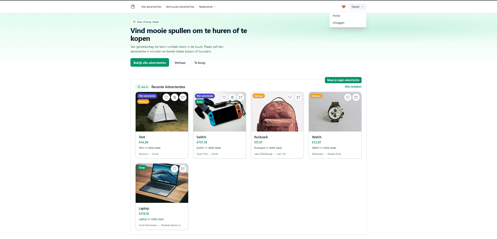

# Bazaar — Auctions & Rentals (Laravel)


[](./LICENSE)

**Rol:** Solo · **Jaar:** 2025

**Marktplaats** met zowel **koop** als **verhuur**. Ondersteunt bieden en accepteren, huurperiodes met voorstel‑/bevestigflow, favorieten, CSV‑import en QR‑codes. Inclusief meertaligheid (NL/EN) en nette, toegankelijke Blade/Tailwind UI.

---

## Tech stack
Laravel 11 · PHP 8.2+ · MySQL/MariaDB · Blade/Tailwind · Alpine.js · Auth scaffold: **Laravel Breeze** · (optioneel) Laravel Sanctum (API tokens) · PHP‑Spreadsheet (CSV) · simplesoftwareio/simple‑qrcode

## Highlights
- **Ads (koop & verhuur)** – koop met één geaccepteerd bod (verkoop), of **verhuur** met datumvoorstel.
- **Biedingen** – plaatsen/acceptatie, UI‑flow voor eigenaar (accept) en huurder (bevestigen).
- **Huurdatums** – eigenaar stelt ophaal/retour voor; huurder bevestigt. Pas na bevestiging zichtbaar in agenda.
- **Agenda “Rented Ads”** – toont alleen geaccepteerde én bevestigde huurperiodes.
- **Favorieten** – “hartje” op kaarten; eigen overzichtspagina.
- **CSV‑import** – snel demo‑/testdata aanmaken via upload.
- **QR‑codes** – per ad (modal + aparte route).
- **i18n** – Nederlands/Engels; taalwisselknop toont actieve taal.

> Business rules (selectie): max. 4 biedingen/advertenties/verhuur‑advertenties per gebruiker; bij retourneren slijtage berekenen + verplichte foto‑upload; advertenties kunnen bundelen (bijv. kettingzaag + olie).

---

## Demo


---

## Snel starten

### Vereisten
- **PHP 8.2+**, **Composer**, **Node 18+** (of 20+), **npm** of **pnpm**
- **MySQL 8+** of **MariaDB 10.6+**

### Installatie
```bash
git clone https://github.com/FreekStraten/marketplace-laravel-2025.git
cd marketplace-laravel-2025

# 1) Dependencies
composer install
npm ci   # of: npm install

# 2) Env & app key
cp .env.example .env
php artisan key:generate

# 3) Database (vul DB_* in .env)
php artisan migrate --seed

# 4) Storage symlink (uploads/qr/…)
php artisan storage:link

# 5) Assets
npm run dev      # voor ontwikkeling
# npm run build  # voor productie

# 6) Start
php artisan serve
# app draait op http://127.0.0.1:8000
```

### Seed logins (demo)
- owner@example.test / `12345678`
- 123@gmail.com / `12345678`
- seller@gmail.com / `12345678`

Elke van de eerste twee accounts heeft minimaal 1 huur‑ en 1 verkoopadvertentie. Seeders vermijden dubbele producten (hergebruiken bestaande items).

### Optioneel (API‑beveiliging met Sanctum)
```bash
composer require laravel/sanctum
php artisan vendor:publish --provider="Laravel\Sanctum\SanctumServiceProvider"
php artisan migrate
```
Registreer tokens via de UI of een route; bescherm API‑routes met `auth:sanctum` middleware.

### Optioneel (taalbestanden)
```
resources/lang/nl/*.php
resources/lang/en/*.php
```
Gebruik `__('messages.key')` in Blade/Controllers. `config/app.php` → `locale` en `fallback_locale`.

---

## Belangrijke schermen/routes
- `/` – homepage met laatste/uitgelichte ads
- `/ads` – overzicht met filter/sort; eigen ads bovenaan (indien ingelogd)
- `/ads/{id}` – detail met biedingen, QR‑code, reviews (voor verhuur)
- `/user-rented-ads` – agenda met bevestigde huurperiodes
- `/favorites` – favorietenoverzicht

---

## Functional notes
- Max. 4 bids per gebruiker (rule in controller).
- Op eigen ad kun je geen bod plaatsen; UI verbergt formulier en toont melding.
- Bij verkoop: geen nieuwe bids na geaccepteerd bod (UI + backend‑check).
- Bij verhuur: datumvoorstel door eigenaar → bevestigen door huurder (`dates_confirmed`).
- Reviews: alleen voor verhuur en pas ná de ophaaldatum.

---

## Configuratie (.env – voorbeeld)
```env
APP_NAME="Marketplace"
APP_URL=http://127.0.0.1:8000

DB_CONNECTION=mysql
DB_HOST=127.0.0.1
DB_PORT=3306
DB_DATABASE=marketplace
DB_USERNAME=root
DB_PASSWORD=secret

# MAIL_* als je mails/contracten wilt versturen
# QUEUE_CONNECTION=database  # als je jobs gebruikt
```

---

## Troubleshooting

- **`vite not recognized`** → run eerst `npm install`.
- **`Could not open input file: artisan`** → run `composer install` zodat `vendor/autoload.php` bestaat.
- **`curl_setopt(): Unable to create temporary file` bij composer** → zorg dat `TEMP/TMP` schrijfbaar is of update Composer (`composer self-update --update-keys`).
- **Database error `Unknown database`** → maak eerst een schema aan in MySQL Workbench (schema = database) en zet de naam in `.env`.
- **`Vite manifest not found`** → start in aparte terminal `npm run dev` of run `npm run build`.

## Projectstructuur (kort)
```
app/Http/Controllers
app/Models
database/migrations
database/seeders
resources/views
resources/js, resources/css
storage/app/public/products/{orig,thumbs}
```


## Credits
Opdrachtcontext: whitelabel marketplace met veilingen & verhuur. Code & documentatie © 2025 Freek Straten.
